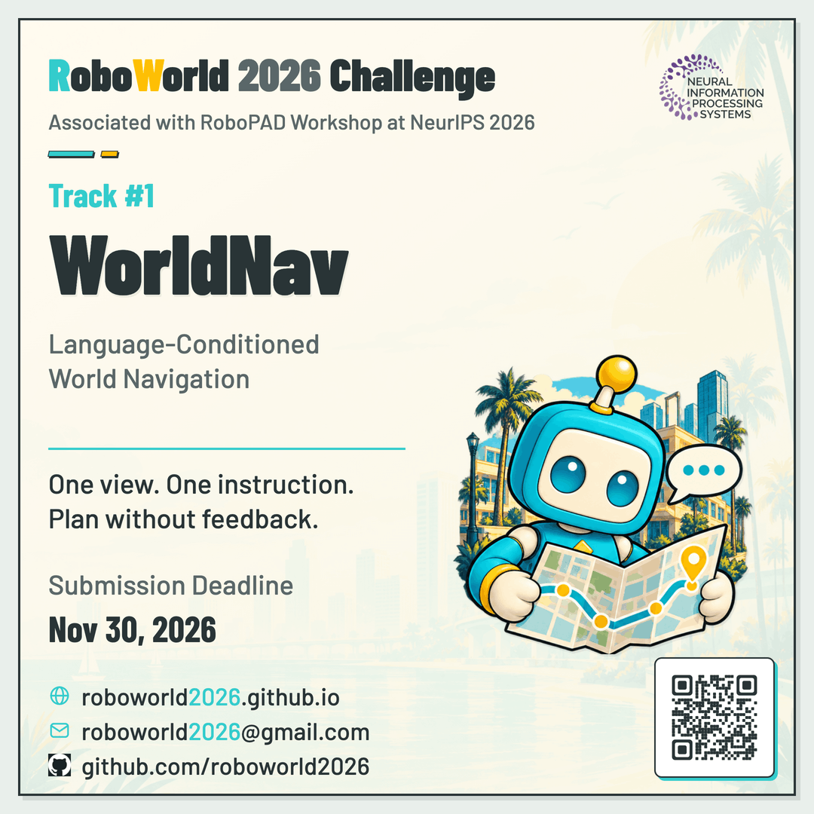
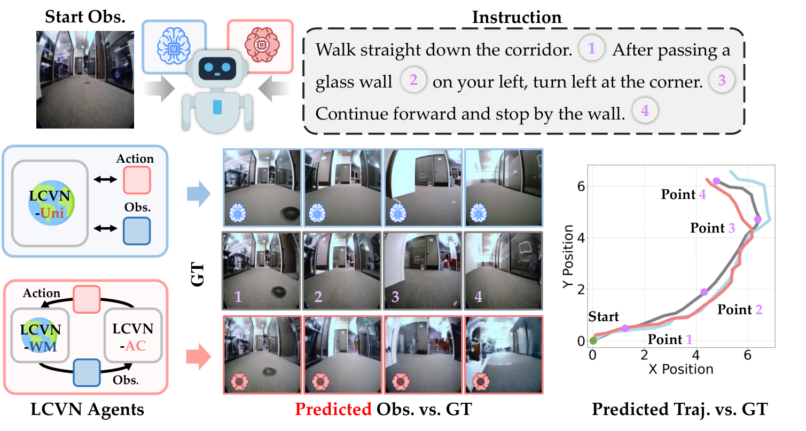

<h1 align="center">🤖 RoboWorld Challenge 2026: Track 1 WorldNav <br> Language-Conditioned World Navigation</h1>

<div align="center">

**Official Track Documentation for [Track 1](https://f1y1113.github.io/worldnav-challenge/)**

*Built on the LCVN benchmark — "Language-Conditioned World Modeling for Visual Navigation"*<br>([LCVN repository](https://github.com/F1y1113/LCVN) | [LCVN dataset](https://huggingface.co/datasets/fly1113/LCVN) | [LCVN paper](https://arxiv.org/abs/2603.26741))

[](https://roboworld2026.github.io/)
[](https://f1y1113.github.io/worldnav-challenge/)
[](https://robotpad2026.github.io/)
[](https://www.codabench.org/competitions/18185/)
[](https://huggingface.co/datasets/fly1113/LCVN)
[](https://arxiv.org/abs/2603.26741)

<p align="center">
  
</p>

**🏆 Awards: Official Certificates for Top 5 Teams & NeurIPS 2026 RoboPAD Workshop Oral Presentations**


</div>


## 🌍 Challenge Overview

**WorldNav** invites participants to develop world-model-based or vision-language-action (VLA) agents for **language-conditioned visual navigation**. Given a single initial egocentric RGB observation and a natural-language instruction, the agent must generate the full future navigation trajectory without a goal image or intermediate environmental feedback. The track encourages methods that couple imagination with control: world models that predict future observations to guide action selection, unified autoregressive models that interleave observation and action prediction, and VLA models that map vision and language to navigation actions. Policy-only methods are also welcome.

<p align="center">
  
</p>

### 🎯 Task Definition

| Component | Description |
|:--|:--|
| **Input** | One initial egocentric RGB image and one natural-language instruction. |
| **Output** | A variable-length sequence of robot-relative forward, leftward, and yaw updates. |
| **Termination** | The agent decides when the trajectory ends; the submitted action sequence is scored as a whole. |
| **Setting** | Open-loop generation: no goal image or intermediate environmental feedback is available. |

Agents may generate the trajectory autoregressively, using their own predicted future observations or states to plan subsequent actions. The instruction remains the navigation goal throughout the rollout.

## 📅 Competition Details

- **Event:** RoboWorld Challenge 2026, affiliated with the [RoboPAD Workshop at NeurIPS 2026](https://robotpad2026.github.io/).
- **Registration:** Follow the registration link on the [challenge website](https://roboworld2026.github.io/).
- **Submission platform:** [CodaBench — WorldNav](https://www.codabench.org/competitions/18185/).

### 🗂️ Phases

| Phase | Evaluation data | Leaderboard |
|:--|:--|:--|
| **Phase 1: Validation** | Released `val_seen` and `val_unseen` splits | Ranked by the mean of the `val_seen` and `val_unseen` Scores (50% each). Both split files are required. |
| **Phase 2: Final Evaluation** | Held-out test split | Ranked by the test Score. |

**Phase 1 supports method development and validation; it does not determine shortlisting, final rankings, or awards. Final rankings and awards are determined entirely by the Phase 2 test Score.** Scores from the two phases are not combined.

### 🗓️ Timeline

| Event | Date |
|:--|:--|
| Team registration opens (Google Form) | October 08, 2026 |
| Phase 1: Validation opens | October 15, 2026, 00:00 UTC |
| Phase 1 closes / Phase 2 opens | October 30, 2026, 23:59 UTC |
| Final submission deadline (Phase 2) | November 30, 2026, 23:59 UTC |
| Awards announcement | December 12, 2026 (RoboPAD Workshop @ NeurIPS 2026) |

See the [CodaBench competition page](https://www.codabench.org/competitions/18185/) for the exact Phase 2 opening and closing times and schedule updates.

### 🏆 Awards & Recognition

Official challenge awards are aligned with the [RoboWorld 2026 Awards & Recognition](https://roboworld2026.github.io/#awards) guidelines:

- **Certificates of Recognition**: The **Top 5 teams in each track** will receive official certificates recognizing their achievements in the RoboWorld Challenge 2026. A **Best Innovative Solution** award will also recognize outstanding creativity and technical innovation.
- **Oral Presentations**: Selected top-performing teams will be invited to give **oral presentations** at the **RoboPAD Workshop** at **NeurIPS 2026**, sharing their methods, results, and insights with the research community.

## 📊 Dataset

The track uses the **LCVN dataset**, comprising **39,016 trajectories** and **117,048 human-verified instructions** sourced from Go Stanford, ReCon, SCAND, HuRoN, and TartanDrive.

Each trajectory is paired with three instruction styles:

- **Concise:** Short instructions containing essential directional cues.
- **Intricate:** Detailed instructions describing visual context, objects, people, and scene layout.
- **Landmark-grounded:** Instructions anchored to salient environmental landmarks.

### Dataset Splits

| Split | Trajectories | Instructions | Use |
|:--|--:|--:|:--|
| Train | 28,813 | 86,439 | Training |
| Validation Seen | 3,602 | 10,806 | In-domain validation |
| Validation Unseen | 1,500 | 4,500 | Unseen-domain validation |
| Test | 5,101 | 15,303 | Final evaluation |
| **Total** | **39,016** | **117,048** | |

Go Stanford, ReCon, SCAND, and HuRoN provide the training and in-domain evaluation data. The unseen validation split is drawn exclusively from TartanDrive. The test split contains trajectories from both TartanDrive and in-domain sources.

The training and validation splits are available on [Hugging Face](https://huggingface.co/datasets/fly1113/LCVN). Phase 2 provides the test inference inputs: initial RGB observations and language instructions. Reference test trajectories and target annotations remain withheld for official evaluation.

## 🚀 Getting Started

### 1. Download the Data

From this track repository, run:

```bash
# Download and extract all released splits.
bash download_data.sh

# Alternatively, download only the Phase 1 validation splits.
SPLITS="val_seen val_unseen" bash download_data.sh
```

The released archives are `train.tar` (57.6 GB), `val_seen.tar` (7.4 GB), and `val_unseen.tar` (20.3 GB).

After extraction, the expected directory structure is:

```text
data/
└── lcvn/
    ├── train/
    │   ├── {trajectory_id}/
    │   │   ├── 0.jpg
    │   │   ├── 1.jpg
    │   │   ├── ...
    │   │   ├── n.jpg
    │   │   └── traj_data.pkl
    │   └── ...
    ├── val_seen/
    │   └── ...
    └── val_unseen/
        └── ...
```

Each `{trajectory_id}/` folder contains a sequence of egocentric RGB frames (`0.jpg`, `1.jpg`, ..., `n.jpg`) and a `traj_data.pkl` file storing trajectory metadata such as navigation actions, pose-related information, and language instructions.

### 2. Set Up a Baseline

Clone the LCVN implementation:

```bash
git clone https://github.com/F1y1113/LCVN.git
cd LCVN
```

Follow the model-specific environment setup, data preparation, training, and inference instructions in the [LCVN README](https://github.com/F1y1113/LCVN#readme). LCVN-Uni and LCVN-WM + LCVN-AC use separate environments.

### 3. Prepare a Submission

Download the example submission ZIP from [CodaBench](https://www.codabench.org/competitions/18185/). It shows the phase's episode IDs and JSON schema; replace the illustrative actions with your predictions and follow [Submission Format](#-submission-format).

## 🧠 Baseline Models

Two complementary LCVN approaches serve as the reference baselines:

| Baseline | Approach |
|:--|:--|
| **LCVN-Uni** | A unified autoregressive multimodal model fine-tuned from Anole-7B that jointly predicts the next action and next observation in a single forward pass. |
| **LCVN-WM + LCVN-AC** | A language-conditioned diffusion world model paired with an actor-critic agent trained entirely in the world model's latent space using intrinsic rollout rewards. |

Implementations and usage instructions are provided in the [LCVN repository](https://github.com/F1y1113/LCVN). See the [LCVN paper](https://arxiv.org/abs/2603.26741) for details.

## 📏 Evaluation

Submissions are evaluated against one recorded navigation trajectory. The leaderboard reports the original trajectory measures **Success Rate (SR)**, **Absolute Trajectory Error (ATE)**, and **Relative Pose Error (RPE)**, together with two continuous measures of the complete route and heading.

| Metric | Direction | Description |
|:--|:--|:--|
| **SR** | Higher is better | Fraction of episodes whose final predicted position meets the reference endpoint criterion. |
| **ATE** | Lower is better | Global trajectory accuracy, measured by the Euclidean distance between aligned predicted and reference poses. |
| **RPE** | Lower is better | Local trajectory consistency, measured by discrepancies in relative motion between consecutive predicted and reference poses. |
| **Full-route fidelity** | Higher is better | Similarity of the entire ordered predicted route to the recorded route, with excess travel penalized. |
| **Heading and turn fidelity** | Higher is better | Agreement of facing direction during travel and of the direction, location and amount of turns. |

### 🏁 Composite Score

**Submissions are ranked by the following Score (higher is better):**

$$
\mathrm{Score}
= \frac{100}{N}\sum_{i=1}^{N}
\frac{\mathrm{FullRouteFidelity}_i(1+\mathrm{HeadingTurnFidelity}_i)}{2}
\left(
0.70+0.10\mathrm{SR}_i+\frac{0.10}{1+\mathrm{ATE}_i}+\frac{0.10}{1+\mathrm{RPE}_i}
\right)
$$

`N` is the number of episodes. `SR_i` is binary success; `ATE_i` and `RPE_i` are per-episode errors in dataset coordinate units. Score averages episode contributions. See [demonstration.py](demonstration.py) for the five metric calculations.

## 📥 Submission Format

Submit predictions as **one ZIP archive** through [CodaBench](https://www.codabench.org/competitions/18185/).

| Phase | Required files at the ZIP archive root |
|:--|:--|
| Phase 1 | `val_seen.json` and `val_unseen.json` |
| Phase 2 | `test.json` |

### Prediction File Structure

The example below illustrates the JSON structure with one episode and three motion commands. It is abbreviated; use the downloadable example submission for the full list of phase episode IDs. The list ends the trajectory, with no separate Stop token.

```json
{
  "split": "val_unseen",
  "episodes": [
    {
      "episode_id": "20210826_40_0001_02_0",
      "actions": [[0.25, 0.0, 0.0], [0.0, 0.0, 0.15], [0.12, -0.05, 0.0]]
    }
  ]
}
```

| Field | Description |
|:--|:--|
| `split` | `val_seen`, `val_unseen`, or `test`, matching the filename. |
| `episodes` | Predictions for every episode in the phase manifest. |
| `episode_id` | Manifest identifier; include each exactly once. |
| `actions` | Variable-length `[dx, dy, dyaw]` sequence. `dx` is forward, `dy` is leftward in the agent's **current local frame**, and `dyaw` is in radians. |

At test time, use only the initial RGB image and instruction; the private scorer reconstructs the route from a withheld initial pose. For global training deltas `(ΔX, ΔY)`, use released training yaw `ψ`: `dx = cos(ψ)ΔX + sin(ψ)ΔY`, `dy = −sin(ψ)ΔX + cos(ψ)ΔY`, and wrap heading updates: `dyaw = np.arctan2(np.sin(dyaw), np.cos(dyaw))` to the canonical range `[−π, π)`.

See [CodaBench](https://www.codabench.org/competitions/18185/) → **Submission & Evaluation** for action limits and the complete example ZIP.

### Package and Upload

For **Phase 1**:

```bash
zip -j submission.zip val_seen.json val_unseen.json
```

For **Phase 2**, create a separate archive:

```bash
zip -j submission_test.zip test.json
```

Place only the required JSON files at the archive root; do not include a parent directory or unrelated files. Upload the archive to the corresponding CodaBench phase, then check the scoring log for validation results and evaluation metrics.

### Submission Limits

Each participant may submit **100 times per day** and **100 times in total per phase**. The leaderboard retains the team's best-scoring submission.

## ❓ Frequently Asked Questions

**1. Do I have to use a world model?**

No. World-model agents, VLA models, and policy-only methods are all eligible. The track particularly encourages approaches that use predicted future states to guide planning.

**2. Do I need to run a simulator or submit executable agent code?**

No simulator or executable agent code is required for the scored submission. Upload the prediction files described in [Submission Format](#-submission-format); the evaluation server scores the submitted trajectories.

**3. Can the agent receive new observations during inference?**

Only the initial RGB observation and the instruction are provided. The agent may generate and use its own predicted future observations, but it cannot access intermediate observations from the environment.

**4. Are test annotations available?**

No. Phase 2 provides the initial observations and instructions needed for inference. Reference test trajectories and target annotations remain withheld.

**5. Which episodes must my submission include?**

Include every episode in the official manifest exactly once. Phase 1 requires 10,806 `val_seen` episodes and 4,500 `val_unseen` episodes, covering the three instruction styles. Copy episode identifiers directly from the manifests.

**6. What should I do if my submission is rejected?**

Check the CodaBench scoring log. A `SUBMISSION REJECTED:` message identifies a submission issue, such as missing episodes, duplicate identifiers, or an incorrect archive layout. Correct the reported issue and resubmit. A `SCORING DATA ERROR (organizer):` message indicates an organizer-side problem; report it to the competition contact email below.

## 🔗 Contact and Resources

For technical or competition questions, contact [roboworld2026@outlook.com](mailto:roboworld2026@outlook.com).

| Resource | Link |
|:--|:--|
| Official Track 1 Website | [RoboWorld 2026 Track 1: WorldNav](https://roboworld2026.github.io/track1) |
| Official Challenge Portal & Registration | [RoboWorld 2026 Registration (Google Form)](https://roboworld2026.github.io/#registration) |
| Official Awards & Recognition | [RoboWorld 2026 Awards](https://roboworld2026.github.io/#awards) |
| Track 2 (HA-VLN 2.0) Website | [RoboWorld 2026 Track 2: HA-VLN 2.0](https://roboworld2026.github.io/track2) |
| Associated Workshop | [RoboPAD at NeurIPS 2026](https://robotpad2026.github.io/) |
| CodaBench Competition Portal | [CodaBench #18185](https://www.codabench.org/competitions/18185/) |
| GitHub Repository | [worldnav-challenge](https://github.com/F1y1113/worldnav-challenge) |
| Track Project Page | [WorldNav](https://f1y1113.github.io/worldnav-challenge/) |
| Metric calculation demonstration | [demonstration.py](demonstration.py) |
| Baseline implementation | [LCVN repository](https://github.com/F1y1113/LCVN) |
| Dataset | [LCVN on Hugging Face](https://huggingface.co/datasets/fly1113/LCVN) |
| Paper | [Language-Conditioned World Modeling for Visual Navigation](https://arxiv.org/abs/2603.26741) |

## 📄 License and Terms

Refer to the [LCVN repository](https://github.com/F1y1113/LCVN), [dataset page](https://huggingface.co/datasets/fly1113/LCVN), and original source datasets for the applicable code and data licenses. Participation is governed by the Track 1 Terms and Conditions on [CodaBench](https://www.codabench.org/competitions/18185/).

## 📚 Citation

If you use the LCVN benchmark or the WorldNav track resources, please cite:

```bibtex
@misc{dong2026lcvn,
      title={Language-Conditioned World Modeling for Visual Navigation}, 
      author={Yifei Dong and Fengyi Wu and Yilong Dai and Lingdong Kong and Guangyu Chen and Yetong Sha and Qiyu Hu and Feng Liu and Siyu Huang and Qi Dai and Zhi-Qi Cheng},
      year={2026},
      eprint={2603.26741},
      archivePrefix={arXiv},
      primaryClass={cs.CV},
      url={https://arxiv.org/abs/2603.26741}, 
}

@misc{roboworld2026track1,
      title={Track 1 | WorldNav: Language-Conditioned World Navigation},
      author={RoboWorld Challenge 2026 Organizers},
      year={2026},
      howpublished={https://roboworld2026.github.io/track1}
}
```

## 🤝 Acknowledgements

WorldNav is organized by the RoboWorld Challenge 2026 team as part of an independently organized challenge associated with the [RoboPAD Workshop at NeurIPS 2026](https://robotpad2026.github.io/). We thank the LCVN authors and contributors, the DFoT, UniWM, and LUMOS teams, and CodaBench for the evaluation infrastructure.
